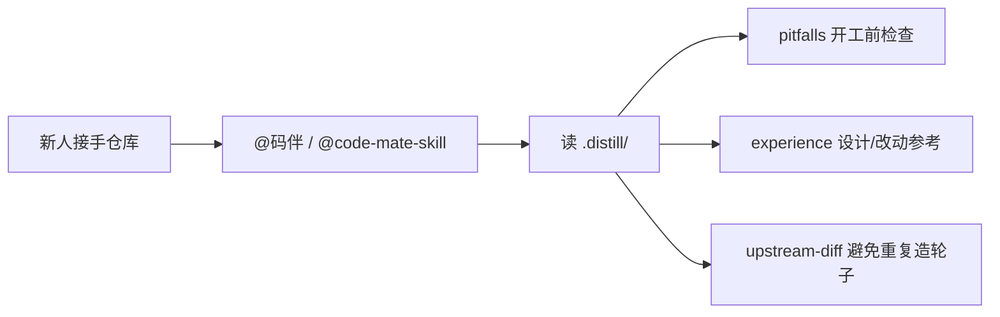
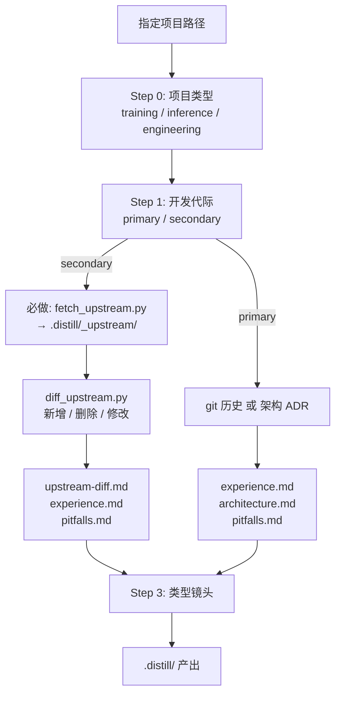

# 码伴 · CodeMate

> **新人算法工程师的代码仓库小助手** — 陪你读懂项目、对比上游、躲开坑。

帮刚接手仓库的同学快速搞懂：**为什么这样写、相对上游改了什么、开工前先别踩哪些坑**。  
主交付是可读的 Markdown + **修改前 / 修改后** 代码对比，不是空泛文档。


|              |                                                                    |
| ------------ | ------------------------------------------------------------------ |
| **名字**       | **码伴** CodeMate（`code-mate`）— 「码」是代码，「伴」是陪你上手                      |
| **定位**       | 算法新人接手训练 / 推理 / 部署仓库时的小助手                                          |
| **版本**       | v1.3                                                               |
| **Agent 入口** | [`SKILL.md`](SKILL.md)（Cursor：`@code-mate-skill` 或 `@码伴`） |
| **目录** | `code-mate-skill/`（本仓库根目录） |
| **适用**       | 训练、推理、工程类代码仓；绿场自研与 fork 改开源                                        |


---

## 给新人算法工程师

你不需要先通读整个仓库。让小助手帮你做三件事：


| 你想…            | 问小助手                                    | 你会得到                                             |
| -------------- | --------------------------------------- | ------------------------------------------------ |
| **接手老项目**      | `蒸馏 <路径>，我是新人，帮我看懂架构`                   | `architecture.md` + `experience.md` 分层 rationale |
| **改开源 / fork** | `蒸馏 <路径>：secondary，对比上游`                | clone 上游 + `upstream-diff.md`（改了什么、为什么改）         |
| **开工写代码前**     | `读 <路径>/.distill/pitfalls 做 pre-flight` | L0/L1 硬坑 + 问题代码 vs 推荐写法                          |
| **接同类任务**      | `类似 SAFMN 的 ONNX 导出要注意什么`               | 同类型项目的经验总则与代码片段                                  |


**新人友好原则**（小助手会遵守）：

- 先判断是 **训练 / 推理 / 工程** 哪类问题，再用对应「镜头」看，不一锅炖
- 每条经验要能指导 **下次怎么做**，并贴真实代码对比
- 没证据的推断会标 `**待验证`**，不装懂
- 改开源必先 **clone 官方仓库** 再对比，避免「凭感觉说 upstream 长什么样」




---

## 它能做什么


| 场景                   | 回答的问题             | 典型产出                              |
| -------------------- | ----------------- | --------------------------------- |
| **一次开发** `primary`   | 为什么这样分层？备选方案为何没选？ | `experience.md` 分层 ADR + 实现代码     |
| **二次开发** `secondary` | 相对官方上游改了什么？为什么改？  | `upstream-diff.md` 三表清单 + 完整 diff |
| **开工前**              | 踩过哪些坑？            | `pitfalls.md` L0–L4 避坑卡 + 问题/推荐代码 |


**五条铁律**（详见 [SKILL.md](SKILL.md)）：

1. 先分型（training / inference / engineering），再分代际（primary / secondary）
2. 经验须可执行，不是目录复述
3. 无证据不立案 — 推测标 `待验证`
4. **secondary 必先 clone 上游**到 `.distill/_upstream/`，再 diff（本地有 `.git` 也不能跳过）
5. 主产出全是 `.md`；`meta.json` 只做索引

---

## 快速开始

### 在 Cursor 里用

```
@码伴 我是新人，帮我蒸馏 LLM ，重点讲清数据到推理流程
```

```
@码伴 蒸馏 OCR，我要改 ONNX 导出，先看 upstream 差异和 pitfalls
```

通用指令：

```
蒸馏 <项目路径>：primary + engineering，按层写 ADR
只补某项目的 upstream-diff
新项目开工前，读该项目 pitfalls 做 pre-flight
```

### 二次开发：标准三步（v1.3 门禁）

在 **gitlab 根目录**执行（需已安装 git、Python 3）：

```bash
# 1. 必做 — clone 官方上游
python code-mate-skill/tools/fetch_upstream.py \
  --repo <owner/name> \
  --ref <branch|tag|commit> \
  --out <project>/.distill/_upstream/<short-name>

# 2. 必做 — 树级 diff，生成三类清单
python code-mate-skill/tools/diff_upstream.py \
  --upstream <project>/.distill/_upstream/<short-name> \
  --local <project> \
  --include networks,models,local_inference \
  --exclude .distill,checkpoints,weights \
  --out <project>/.distill/_file_inventory.json

# 3. 必做 — 单文件 hunk（对每个 modified 文件）
git diff --no-index \
  <project>/.distill/_upstream/<short-name>/<file> \
  <project>/<file>
```

然后由 Agent 按模板写入 `<project>/.distill/*.md`。

### 一次开发：路径选择


| 条件            | 做法                                        |
| ------------- | ----------------------------------------- |
| 全程有 git       | `git log` / `git show` 读设计演进              |
| 无 `.git`      | 架构拆解 + 推断 ADR                             |
| 中途 `git init` | 架构 + 根 commit **与** init 后 `git log` 两段都做 |


---

## 决策流程




---

## 产出目录

蒸馏完成后，项目下会出现：

```
<project>/.distill/
├── README.md                 # 索引与扫描摘要
├── _upstream/<short-name>/   # secondary 必做：clone 的上游树
├── _file_inventory.json      # secondary：三类清单 JSON
├── experience.md             # ★ 主交付：总则 + 动机 + 代码对比
├── upstream-diff.md          # secondary：清单全集 + 完整 diff
├── pitfalls.md               # 避坑（≥3 条含代码块）
├── architecture.md           # 架构快照与入口契约
└── meta.json                 # 分类 / upstream commit / counts
```


| 文件                 | primary     | secondary               | 代码对比    |
| ------------------ | ----------- | ----------------------- | ------- |
| `experience.md`    | 分层 ADR + 实现 | 改动簇 + upstream vs local | 必填      |
| `upstream-diff.md` | —           | 三表 + §代码对比全集            | 必填      |
| `pitfalls.md`      | 避坑卡         | 同左                      | ≥3 条含代码 |


格式规范：[prompts/code_diff.md](prompts/code_diff.md) · 模板：[OUTPUT-TEMPLATES.md](OUTPUT-TEMPLATES.md)

---

## 仓库结构

```
code-mate-skill/          # 码伴 CodeMate 技能包
├── SKILL.md                      # Agent 主指令（name: code-mate）
├── README.md                     # 本文件 — 人类阅读概览
├── TODO.md                       # 后续提示词 / tools 路线图
├── reference.md                  # 分类与路径细则
├── OUTPUT-TEMPLATES.md           # 各 .md 产出模板
├── examples.md                   # 指令与片段示例
├── scan-manifest.yaml            # 可选多项目注册表
├── tools/
│   ├── fetch_upstream.py         # clone 上游到 _upstream/
│   └── diff_upstream.py          # 本地 vs 上游树级 diff
└── prompts/
    ├── classify.md               # Step 0/1 分类
    ├── secondary_upstream_diff.md  # secondary 完整流程（含 clone 门禁）
    ├── primary_layer_rationale.md  # primary ADR
    ├── code_diff.md              # 修改前/后代码块规范
    ├── experience_synthesizer.md   # experience 合成
    ├── pitfall_analyzer.md       # pitfalls 提炼
    ├── architecture_snapshot.md  # 架构快照
    ├── training_lens.md          # 训练镜头检查单
    ├── inference_lens.md         # 推理镜头
    └── engineering_lens.md       # 工程镜头
```

---

## 工具说明

### `fetch_upstream.py`

将官方仓库 clone 到指定目录，并输出锁定 commit（JSON）。

```bash
python tools/fetch_upstream.py \
  --repo owner/SAFMN \
  --ref main \
  --out SAFMN/.distill/_upstream/SAFMN
```

### `diff_upstream.py`

对比 `_upstream/` 与本地项目树，输出 **新增 / 删除 / 修改** 清单。

```bash
python tools/diff_upstream.py \
  --upstream SAFMN/.distill/_upstream/SAFMN \
  --local SAFMN \
  --out SAFMN/.distill/_file_inventory.json
```

> 更多自动化（一键门禁、产出校验、批量 diff）见 [TODO.md](TODO.md)。

---

## 分类速查

### 项目类型 `project_type`


| 类型              | 关注点                 |
| --------------- | ------------------- |
| **training**    | 数据、实验、复现、checkpoint |
| **inference**   | 契约、批处理、ONNX/TRT、上线  |
| **engineering** | 网关、Agent、前后端、鉴权、观测  |


混合项目可设 `primary` + `secondary` 类型，分节撰写，不强行单标签。

### 开发代际 `dev_mode`


| 模式            | 判定信号                                        |
| ------------- | ------------------------------------------- |
| **secondary** | README fork、vendor、upstream remote、保留上游目录结构 |
| **primary**   | 自研架构、无单一上游、绿场 scaffold                      |


### Pitfall 分级

`L0` 硬教训 → `L1` 架构 → `L2` 约定漂移 → `L3` 集成迁移 → `L4` 可接受债务  

**L0 不可为省事破例。**

---

## 文档索引


| 文档                                                                       | 用途                         |
| ------------------------------------------------------------------------ | -------------------------- |
| [SKILL.md](SKILL.md)                                                     | Agent 完整执行流程与铁律            |
| [reference.md](reference.md)                                             | 分类决策、upstream 路径、hybrid 判定 |
| [OUTPUT-TEMPLATES.md](OUTPUT-TEMPLATES.md)                               | 各产出 Markdown 的结构模板         |
| [prompts/secondary_upstream_diff.md](prompts/secondary_upstream_diff.md) | secondary 必先 clone 的逐步说明   |
| [prompts/code_diff.md](prompts/code_diff.md)                             | 修改前/后代码块与三表清单格式            |
| [examples.md](examples.md)                                               | 对话指令与对比片段示例                |
| [TODO.md](TODO.md)                                                       | 待实现的 lens、tools、校验脚本       |
| [scan-manifest.yaml](scan-manifest.yaml)                                 | 多项目 monorepo 可选预填          |


---

## 许可与贡献

- 新能力提议：写入 [TODO.md](TODO.md) 按文末格式追加条目
- 实现 TODO 项后：勾选 TODO、同步更新 `SKILL.md` §9 迭代说明

